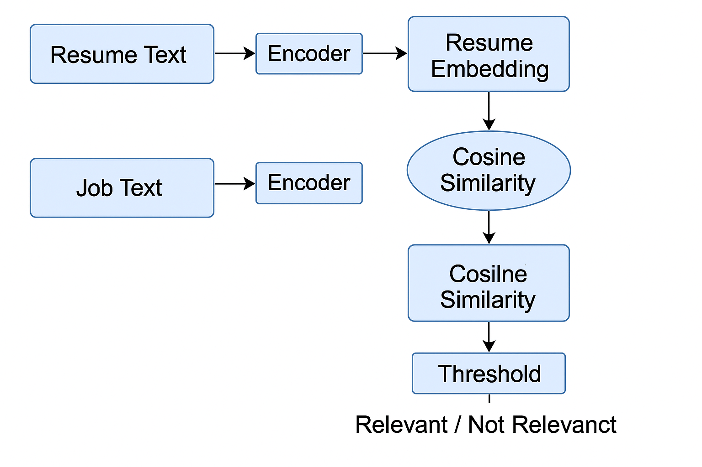
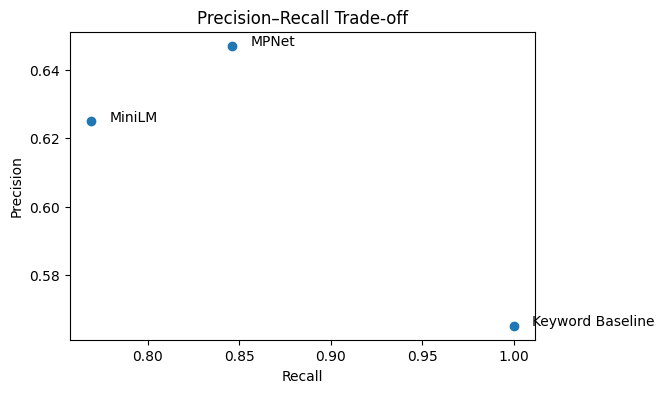

# Resume-Job-Matching
Mini AI pipeline to predict whether a resume is relevant to a given job description.

---

## 1. Introduction

Automated resume job matching is a core component of modern recruitment platforms. Given a large number of resumes and job postings, recruiters rely on automated systems to efficiently identify suitable candidates. However, this task is challenging due to varied wording, overlapping skills across roles, and ambiguous job requirements.

In this project, we design a **mini AI pipeline** to predict whether a resume is relevant to a given job description. We compare a **naïve keyword-based baseline** with **two embedding, based pipelines** that use pre-trained language models. The goal is not to achieve state-of-the-art performance, but to practice the AI workflow: problem formulation, baseline design, pipeline construction, evaluation, and reflection.

---

## 2. Task Definition

### Task Description

Given a pair consisting of:

* a **resume** describing a candidate’s skills and experience, and
* a **job description** specifying required skills and role responsibilities,

the task is to predict whether the resume is **relevant** to the job.

### Input / Output

* **Input:** (resume text, job description text)
* **Output:** Binary label

  * `1` = relevant match
  * `0` = not relevant

### Success Criteria

A system is considered successful if it can accurately distinguish relevant from non-relevant resume–job pairs on unseen data, measured using precision, recall, and F1-score.

---

## 3. Dataset

### Dataset Construction

Due to the sensitive and private nature of real resume data, we construct a **synthetic dataset** of resume–job pairs. This allows controlled experimentation while avoiding ethical and privacy concerns.

Each resume and job description is generated from a predefined pool of common technical skills (e.g., Python, SQL, machine learning, React) and role titles (e.g., backend developer, data scientist). A resume–job pair is labeled as **relevant** if the resume and job share at least two overlapping skills; otherwise, it is labeled as non-relevant.

### Dataset Statistics

* **Total examples:** 150 resume–job pairs
* **Train / Test split:** 80% / 20%
* **Train set:** 120 examples
* **Test set:** 30 examples

### Preprocessing

* Lowercasing
* Basic tokenization (handled internally by embedding models)
* No manual feature engineering

---

## 4. Naïve Baseline

### Method: Keyword Overlap

The naïve baseline uses **lexical keyword overlap** between the resume and job description:

1. Tokenize both texts into word sets.
2. Count the number of shared words.
3. If the overlap score exceeds a threshold (tuned on the training set), classify the pair as relevant.

### Why This Is Naïve

* Relies solely on exact word matching.
* Fails when similar skills are described using different terms.
* Ignores overall role semantics and context.

### Expected Failure Modes

* Over-predicts relevance for resumes with generic technical keywords.
* Cannot capture semantic similarity or paraphrasing.

---

## 5. AI Pipelines

### Pipeline Overview

We implement two embedding-based pipelines that replace lexical matching with **semantic similarity**.

**Figure 1** illustrates the overall pipeline: resumes and job descriptions are encoded into sentence embeddings, cosine similarity is computed, and a threshold-based decision determines relevance.

### Pipeline Stages

1. **Text Encoding**
   Both resumes and job descriptions are encoded using pre-trained sentence embedding models.

2. **Representation Models**

   * **MiniLM:** `all-MiniLM-L6-v2` (lightweight and fast)
   * **MPNet:** `all-mpnet-base-v2` (higher-capacity representation)

3. **Similarity Computation**
   Cosine similarity is computed between resume and job embeddings.

4. **Decision Rule**
   A similarity threshold, tuned on the training set, determines whether a pair is classified as relevant.

### Motivation for Two Models

Using two models allows a controlled comparison between a lightweight embedding model and a higher-capacity model, highlighting trade-offs between efficiency and semantic expressiveness.

---

## 6. Evaluation and Results

### Metrics

We evaluate all methods using:

* **Precision:** proportion of predicted matches that are correct
* **Recall:** proportion of true matches that are successfully identified
* **F1-score:** harmonic mean of precision and recall

### Quantitative Results

| Method           | Precision | Recall    | F1        |
| ---------------- | --------- | --------- | --------- |
| Keyword Baseline | 0.565     | **1.000** | 0.722     |
| MiniLM Pipeline  | 0.625     | 0.769     | 0.690     |
| MPNet Pipeline   | **0.647** | 0.846     | **0.733** |

### Precision–Recall Trade-off

**Figure 2:** Precision–recall comparison of the keyword baseline and embedding-based pipelines. Each point represents a method evaluated with a fixed decision threshold.

### Discussion

The keyword baseline achieves perfect recall by labeling many resume–job pairs as relevant. While this ensures that no relevant matches are missed, it results in many false positives and lower precision.

The embedding-based pipelines are more selective. The MiniLM pipeline improves precision by capturing semantic similarity but sacrifices recall. The MPNet pipeline achieves the best overall balance, improving both precision and recall compared to MiniLM and slightly outperforming the baseline in F1-score. This demonstrates the benefit of higher-capacity semantic representations for matching tasks.

---

## 7. Qualitative Analysis

To better understand the differences between methods, we examine representative cases where the baseline and embedding-based pipelines produce different predictions.

### Example Case 1: False Positive by Keyword Baseline

* **Resume:** Mentions Python, SQL, and data analysis.
* **Job Description:** Frontend developer role focusing on React and UI development.
* **Baseline Prediction:** Relevant (due to overlapping generic keywords).
* **Embedding Prediction:** Not relevant.

The keyword baseline incorrectly predicts a match because it relies on surface-level overlap, while the embedding model correctly captures the mismatch in role intent.

### Example Case 2: Semantic Match Missed by Baseline

* **Resume:** Describes experience with deep learning and PyTorch.
* **Job Description:** Requires expertise in neural networks and model training.
* **Baseline Prediction:** Not relevant (no exact keyword match).
* **Embedding Prediction:** Relevant.

Here, the embedding-based pipeline successfully captures semantic similarity between related concepts that are lexically different.

### Example Case 3: Borderline Match

* **Resume:** Lists Python and basic data processing skills.
* **Job Description:** Seeks a data scientist with broader machine learning expertise.
* **Baseline Prediction:** Relevant.
* **Embedding Prediction:** Not relevant.

This example highlights how embedding models are more selective, rejecting borderline cases where skill overlap is limited.

---

## 8. Reflection and Limitations

This project showed that simple baselines can be surprisingly strong, especially when recall-heavy metrics are used. Designing a fair evaluation setup, including proper train/test splits and threshold tuning, was more important than initially expected.

While embedding-based pipelines improved semantic understanding, the synthetic nature of the dataset limits real-world applicability. Real resumes are longer, noisier, and more diverse than our generated examples. Additionally, binary relevance labels oversimplify hiring decisions, which are inherently multi-dimensional.

With more time or data, future work could explore ranking-based metrics such as Precision@k, incorporate multiple job categories, or evaluate domain shift using real-world datasets.

---

## 9. Reproducibility

All experiments are implemented in a Jupyter notebook and can be run end-to-end on CPU. Random seeds are fixed to ensure reproducibility.

---

## 10. References

* Reimers, N., & Gurevych, I. (2019). *Sentence-BERT: Sentence Embeddings using Siamese BERT-Networks.*
* SentenceTransformers documentation: [https://www.sbert.net/](https://www.sbert.net/)

